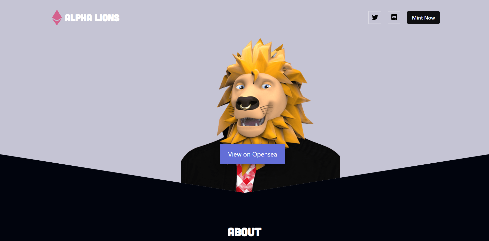

# NFT-Mint-Staking-DApp

[](https://twitter.com/kds_JS)


### Il s'agit d'une Landing Page d'une collection NFT
#### Le site est responsive
 
## [LIVE ICI](https://my-nfts-kds.vercel.app/)

## Technologies utilisés 
 - React JS
 - Chakra UI

### Installation

1. Cloner le repo github
   ```sh
   https://github.com/Kds-JS/NFT-landing-page.git
   ```
2. Installer les dépendances
   ```sh
   npm install
   ```
3. Lancer l'application
   ```sh
   npm start
   ```

## Contact

Kds - [@twitter](https://twitter.com/kds_JS) 

Lien du Projet: [https://github.com/Kds-JS/NFT-landing-page.git])
